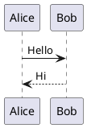
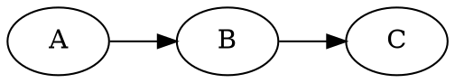

# pandia

Markdown-to-PDF/HTML converter with built-in support for diagrams and LaTeX math.
All diagrams render as **vector graphics** (PDF/SVG) for crisp output at any zoom level.

## Supported Features

| Feature    | Code Block Syntax   | Output Format          |
|------------|---------------------|------------------------|
| PlantUML   | `` ```plantuml ``   | Vector (PDF/SVG)       |
| Graphviz   | `` ```graphviz ``   | Vector (PDF/SVG)       |
| Mermaid    | `` ```mermaid ``    | Vector (PDF/SVG)       |
| Ditaa      | `` ```ditaa ``      | Raster (PNG)           |
| TikZ       | `` ```tikz ``       | Vector (PDF), PNG in HTML |
| LaTeX Math | `$...$` / `$$...$$` | Native (Pandoc)        |

## Installation

### macOS / Linux (Homebrew)

```bash
brew install yaccob/tap/pandia
```

This installs `pandia` and all required tools (Pandoc, PlantUML, Graphviz, Mermaid CLI, librsvg).

> **Note:** PDF output requires a LaTeX distribution. Install with `brew install --cask basictex`.

### Manual Install

```bash
curl -fsSL https://raw.githubusercontent.com/yaccob/pandia/v1.1.0/install.sh | sh
```

Installs the `pandia` script to `~/.local/bin`. You still need either:
- **Local tools:** `pandoc`, `plantuml`, `dot`, `mmdc`, `rsvg-convert`, `pdflatex`
- **Or just Docker/Podman** — pandia uses it as automatic fallback

### Docker Only

```bash
docker pull yaccob/pandia
docker run --rm -v "$PWD:/data" yaccob/pandia --all myfile.md
```

## Usage

```
pandia [OPTIONS] <input.md>

Options:
  --pdf              Generate PDF output (default)
  --html             Generate HTML output
  --all              Generate both PDF and HTML
  --watch            Watch for changes and regenerate automatically
  -o, --output NAME  Base name for output files (default: derived from input)
  --docker           Force Docker mode (skip local tools)
  --local            Force local mode (fail if tools missing)
  -v, --version      Show version
  -h, --help         Show this help
```

### Examples

```bash
# Generate PDF (default)
pandia myfile.md

# Generate both PDF and HTML
pandia --all myfile.md

# Watch mode — regenerate on every save
pandia --watch --all myfile.md

# Custom output name
pandia --all -o report myfile.md

# Force Docker even if local tools are available
pandia --docker --all myfile.md
```

## Example Document

````markdown
---
title: "Demo"
---

## Sequence Diagram



## Flowchart


## State Machine



## Formula

$$E = mc^2$$
````

## How It Works

pandia wraps [Pandoc](https://pandoc.org/) with a custom Lua filter that intercepts
`plantuml`, `graphviz`, `mermaid`, and `ditaa` code blocks, renders them via their
respective CLI tools, and passes the results back to Pandoc for PDF or HTML output.

- **Local mode:** Calls tools directly — fast, no overhead
- **Docker mode:** Runs everything in a self-contained container — no setup required

The CLI automatically detects which mode to use: local tools if available, Docker as fallback.

## License

MIT
