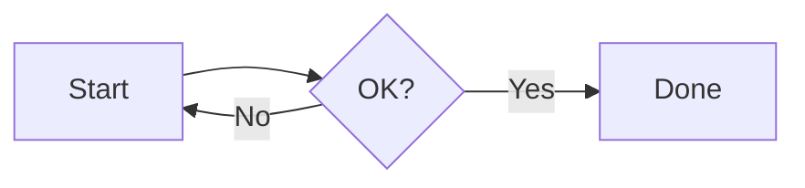
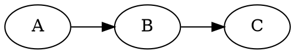

# pandia

Markdown-to-PDF/HTML converter with built-in support for diagrams and LaTeX math.
Most diagrams render as **vector graphics** (PDF/SVG) for crisp output at any zoom level.

## Supported Features

**Built-in (pandia native)**

| Feature    | Code Block Syntax   | Output Format             |
|------------|---------------------|---------------------------|
| Dir Tree   | `` ```dir ``        | Vector (SVG)              |

**Pandoc native**

| Feature    | Syntax              | Output Format             |
|------------|---------------------|---------------------------|
| LaTeX Math | `$...$` / `$$...$$` | Native (Pandoc)           |

**Local tools** (no network required)

| Feature    | Code Block Syntax   | Output Format             |
|------------|---------------------|---------------------------|
| PlantUML   | `` ```plantuml ``   | Vector (PDF/SVG)          |
| Graphviz   | `` ```graphviz ``   | Vector (PDF/SVG)          |
| Mermaid    | `` ```mermaid ``    | Vector (PDF/SVG)          |
| Markmap    | `` ```markmap ``    | Interactive HTML / Vector PDF |
| Ditaa      | `` ```ditaa ``      | Raster (PNG)              |
| TikZ       | `` ```tikz ``       | Vector (PDF), PNG in HTML |

**Container-native** (available in Docker/Podman, with Kroki fallback locally)

| Feature    | Code Block Syntax   | Output Format             |
|------------|---------------------|---------------------------|
| Nomnoml    | `` ```nomnoml ``    | Vector (PDF/SVG)          |
| DBML       | `` ```dbml ``       | Vector (PDF/SVG)          |
| D2         | `` ```d2 ``         | Vector (PDF/SVG)          |
| WaveDrom   | `` ```wavedrom ``   | Vector (PDF/SVG)          |

**Kroki-powered** (requires `--kroki-server URL`)

| Feature    | Code Block Syntax   | Output Format             |
|------------|---------------------|---------------------------|
| BPMN       | `` ```bpmn ``       | Vector (PDF/SVG)          |
| ERD        | `` ```erd ``        | Vector (PDF/SVG)          |
| Svgbob     | `` ```svgbob ``     | Vector (PDF/SVG)          |
| Pikchr     | `` ```pikchr ``     | Vector (PDF/SVG)          |
| + many more | See [Kroki docs](https://kroki.io/#support) | Vector (PDF/SVG) |

> **Note:** Container-native types (Nomnoml, DBML, D2, WaveDrom) are always available
> in the Docker/Podman image. When running locally without these tools installed,
> they fall back to Kroki automatically if `--kroki-server` is configured.

## Installation

### macOS / Linux (Homebrew)

```bash
brew install yaccob/tap/pandia
```

This installs `pandia` and all required tools (Pandoc, PlantUML, Graphviz, Mermaid CLI, Markmap CLI, librsvg).

> **Note:** PDF output requires a LaTeX distribution. Install with `brew install --cask basictex`.

### Manual Install

```bash
curl -fsSL https://raw.githubusercontent.com/yaccob/pandia/master/install.sh | sh
```

Installs the `pandia` script to `~/.local/bin`. You still need either:
- **Local tools:** `pandoc`, `plantuml`, `dot`, `mmdc`, `rsvg-convert`, `pdflatex`
- **Or just Docker/Podman** — use with `--server` or `pandia-serve`

### Docker Only

```bash
docker pull yaccob/pandia
docker run --rm -v "$PWD:/data" yaccob/pandia -t pdf -o output.pdf myfile.md
```

### VS Code Extension

A preview extension is available in `pandia-vscode/`. It renders Markdown with all
diagram types in a live preview panel, including interactive Markmap mind maps.

```bash
make vscode-install
```

See [pandia-vscode/README.md](pandia-vscode/README.md) for details.

## Usage

```
pandia [OPTIONS] <input.md>

Options:
  -t, --to FORMAT       Output format: pdf, html (default: html)
  -o, --output FILE     Write output to FILE (default: stdout)
  --watch               Watch for changes and regenerate (requires -o)
  --server URL          Use a pandia server instead of local tools
  --maxwidth WIDTH      Max content width for HTML output (default: 60em)
  --center-math         Center block formulas (default: left-aligned)
  --kroki-server URL    Enable Kroki for additional diagram types (local mode only)
  -v, --version         Show version
  -h, --help            Show this help
```

### Output Modes

Without `-o`, pandia writes the rendered document to **stdout** — ideal for piping:

```bash
pandia myfile.md > output.html
pandia -t pdf myfile.md > output.pdf
pandia myfile.md | less
```

With `-o FILE`, pandia writes to a file and shows progress on stderr:

```bash
pandia -o report.html myfile.md
pandia -t pdf -o report.pdf myfile.md
```

### Server Mode

pandia can use a remote server for rendering instead of local tools.

**Start a server:**

```bash
# Locally
pandia-serve 3300

# Via Docker/Podman
docker run -d -p 3300:3300 yaccob/pandia pandia-serve 3300
```

**Use a server:**

```bash
pandia --server http://localhost:3300 myfile.md > output.html
pandia --server http://localhost:3300 -t pdf -o output.pdf myfile.md
```

### HTTP API

The server exposes two endpoints. See [`openapi.yaml`](openapi.yaml) for the
full OpenAPI 3.0 specification.

| Endpoint | Method | Input | Output | Use Case |
|----------|--------|-------|--------|----------|
| `/health` | GET | — | `ok` (text) | Health check / readiness probe |
| `/render` | POST | Raw Markdown (body) | HTML or PDF (binary) | Rendering, editor integrations |

**`POST /render`** accepts raw Markdown as the request body and returns the
rendered document directly. All images are inlined (self-contained HTML).
Query parameters control the output:

| Parameter | Values | Default | Description |
|-----------|--------|---------|-------------|
| `format` | `html`, `pdf` | `html` | Output format |
| `math` | `mathjax`, `mathml` | `mathjax` | Math rendering engine |
| `maxwidth` | CSS value | `60em` | Max content width (HTML) |
| `center_math` | `true`, `false` | `false` | Center display math |
| `kroki_server` | URL | — | Kroki server for extra diagram types |

```bash
# Render to HTML
curl -X POST http://localhost:3300/render \
  --data-binary @myfile.md > output.html

# Render to PDF
curl -X POST "http://localhost:3300/render?format=pdf" \
  --data-binary @myfile.md > output.pdf

# With Kroki diagrams
curl -X POST "http://localhost:3300/render?kroki_server=https://kroki.io" \
  --data-binary @myfile.md > output.html
```

### Examples

```bash
# Generate HTML to stdout (default)
pandia myfile.md > output.html

# Generate PDF to stdout
pandia -t pdf myfile.md > output.pdf

# Write to file with progress output on stderr
pandia -o report.html myfile.md
pandia -t pdf -o report.pdf myfile.md

# Watch mode — regenerate on every save (requires -o)
pandia --watch -o report.html myfile.md

# Custom max width
pandia --maxwidth 40em myfile.md > output.html

# Center block formulas (default is left-aligned)
pandia --center-math -t pdf -o report.pdf myfile.md

# Enable Kroki diagram types (BPMN, D2, ERD, ...)
pandia --kroki-server https://kroki.io myfile.md > output.html

# Use a pandia server
pandia --server http://localhost:3300 -o output.html myfile.md

# Docker: render to file
docker run --rm -v "$PWD:/data" yaccob/pandia -t pdf -o output.pdf myfile.md

# Docker: start server
docker run -d -p 3300:3300 yaccob/pandia pandia-serve 3300
```

## Example Document

````markdown
---
title: "Demo"
---

## Sequence Diagram

```plantuml
Alice -> Bob : Hello
Bob --> Alice : Hi
```

## Flowchart



## State Machine



## Mind Map

```markmap
# Project
## Design
### UX Research
### Wireframes
## Development
### Backend
### Frontend
```

## Database Schema

```dbml
Table users {
  id integer [primary key]
  name varchar
}
Table posts {
  id integer [primary key]
  user_id integer [ref: > users.id]
}
```

## Formula

$$E = mc^2$$

## Directory Tree

```dir
my-project
  src
    index.ts
    utils.ts
  tests/
  README.md
```
````

### Directory Tree Syntax

The `dir` block renders directory trees as SVG graphics. The syntax is plain
indented text — no special characters needed:

- **Indentation** defines the hierarchy (consistent spaces per level)
- **Trailing `/`** marks a directory (displayed in bold, slash stripped from output)
- Entries with children are automatically detected as directories
- The root entry (first line, no indentation) is always bold

## How It Works

pandia wraps [Pandoc](https://pandoc.org/) with a custom Lua filter that intercepts
diagram code blocks, renders them via their respective tools, and passes the results
back to Pandoc for PDF or HTML output.

Supported tools are called directly as subprocesses — PlantUML, Graphviz, Mermaid CLI,
Markmap, TikZ (via pdflatex), and a Node.js-based renderer for Nomnoml, DBML, D2, and
WaveDrom. All diagram groups run concurrently for fast rendering.

- **Local mode** (`pandia`): Calls tools directly — fast, no overhead
- **Server mode** (`pandia --server URL`): Delegates rendering to a pandia server
- **Docker** (`pandia-serve`): HTTP API for integration with editors and CI pipelines

## Why "pandia"?

The name is a blend of **Pan**doc and **dia**grams — the two things this tool
brings together. It also happens to echo the Greek *pan* (all) and *dia* (through),
which isn't a bad motto for a converter that pushes everything through one pipeline.
And if you want to get mythological: Pandia was a Greek goddess of the full moon,
daughter of Zeus and Selene — illuminating things that would otherwise stay in the dark.
Much like your diagrams before you ran `pandia`.

## License

MIT
