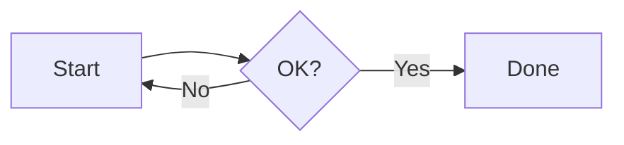
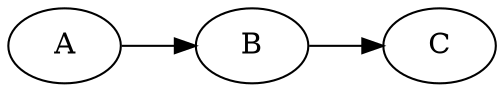

# pandia

Markdown-to-PDF/HTML converter with built-in support for diagrams and LaTeX math.
Most diagrams render as **vector graphics** (PDF/SVG) for crisp output at any zoom level.

## Supported Features

**Built-in (pandia native)**

| Feature    | Code Block Syntax   | Output Format             |
|------------|---------------------|---------------------------|
| Dir Tree   | `` ```dir ``        | Vector (SVG)              |

**Pandoc native**

| Feature    | Syntax              | Output Format             |
|------------|---------------------|---------------------------|
| LaTeX Math | `$...$` / `$$...$$` | Native (Pandoc)           |

**Local tools** (no network required)

| Feature    | Code Block Syntax   | Output Format             |
|------------|---------------------|---------------------------|
| PlantUML   | `` ```plantuml ``   | Vector (PDF/SVG)          |
| Graphviz   | `` ```graphviz ``   | Vector (PDF/SVG)          |
| Mermaid    | `` ```mermaid ``    | Vector (PDF/SVG)          |
| Markmap    | `` ```markmap ``    | Interactive HTML / Vector PDF |
| Ditaa      | `` ```ditaa ``      | Raster (PNG)              |
| TikZ       | `` ```tikz ``       | Vector (PDF), PNG in HTML |

**Container-native** (available in Docker/Podman, with Kroki fallback locally)

| Feature    | Code Block Syntax   | Output Format             |
|------------|---------------------|---------------------------|
| Nomnoml    | `` ```nomnoml ``    | Vector (PDF/SVG)          |
| DBML       | `` ```dbml ``       | Vector (PDF/SVG)          |
| D2         | `` ```d2 ``         | Vector (PDF/SVG)          |
| WaveDrom   | `` ```wavedrom ``   | Vector (PDF/SVG)          |

**Kroki-powered** (requires `--kroki` flag or `--kroki-server URL`)

| Feature    | Code Block Syntax   | Output Format             |
|------------|---------------------|---------------------------|
| BPMN       | `` ```bpmn ``       | Vector (PDF/SVG)          |
| ERD        | `` ```erd ``        | Vector (PDF/SVG)          |
| Svgbob     | `` ```svgbob ``     | Vector (PDF/SVG)          |
| Pikchr     | `` ```pikchr ``     | Vector (PDF/SVG)          |
| + many more | See [Kroki docs](https://kroki.io/#support) | Vector (PDF/SVG) |

> **Note:** Container-native types (Nomnoml, DBML, D2, WaveDrom) are always available
> in the Docker/Podman image. When running locally without these tools installed,
> they fall back to Kroki automatically if `--kroki` or `--kroki-server` is configured.

## Installation

### macOS / Linux (Homebrew)

```bash
brew install yaccob/tap/pandia
```

This installs `pandia` and all required tools (Pandoc, PlantUML, Graphviz, Mermaid CLI, Markmap CLI, librsvg).

> **Note:** PDF output requires a LaTeX distribution. Install with `brew install --cask basictex`.

### Manual Install

```bash
curl -fsSL https://raw.githubusercontent.com/yaccob/pandia/master/install.sh | sh
```

Installs the `pandia` script to `~/.local/bin`. You still need either:
- **Local tools:** `pandoc`, `plantuml`, `dot`, `mmdc`, `rsvg-convert`, `pdflatex`
- **Or just Docker/Podman** — pandia uses it as automatic fallback

### Docker Only

```bash
docker pull yaccob/pandia
docker run --rm -v "$PWD:/data" yaccob/pandia -t pdf -t html myfile.md
```

### VS Code Extension

A preview extension is available in `pandia-vscode/`. It renders Markdown with all
diagram types in a live preview panel, including interactive Markmap mind maps.

```bash
make vscode-install
```

See [pandia-vscode/README.md](pandia-vscode/README.md) for details.

## Usage

```
pandia [OPTIONS] <input.md>

Options:
  -t, --to FORMAT       Output format: pdf, html (default: html; repeatable)
  --watch               Watch for changes and regenerate automatically
  --serve [PORT]        Start HTTP API server (Docker mode, default port: 3300)
                        (other options do not apply in server mode)
  -o, --output NAME     Base name for output files (default: derived from input)
  --maxwidth WIDTH      Max content width for HTML output (default: 60em)
  --center-math         Center block formulas (default: left-aligned)
  --kroki               Enable Kroki for additional diagram types (uses $PANDIA_KROKI_URL)
  --kroki-server URL    Enable Kroki with explicit server URL
  --docker              Force Docker mode (skip local tools)
  --local               Force local mode (fail if tools missing)
  -v, --version         Show version
  -h, --help            Show this help
```

### Server Mode (`--serve`)

`--serve` starts pandia as an HTTP server inside a Docker/Podman container.
CLI options like `-t`, `-o`, `--watch`, `--maxwidth`, `--center-math` do **not**
apply in server mode — rendering parameters are passed per-request via the API.

```bash
docker run -d -p 3300:3300 -v "$PWD:/data" --name pandia yaccob/pandia --serve
```

### HTTP API

The server exposes three endpoints. See [`openapi.yaml`](openapi.yaml) for the
full OpenAPI 3.0 specification.

| Endpoint | Method | Input | Output | Use Case |
|----------|--------|-------|--------|----------|
| `/health` | GET | — | `ok` (text) | Health check / readiness probe |
| `/render` | GET, POST | File path on disk | JSON with generated file paths | Batch rendering, CI pipelines |
| `/preview` | POST | Raw Markdown (body) | Self-contained HTML | Live preview, editor integrations |

**`/render`** reads a `.md` file from the container's `/data` volume, writes
output files (`.html`, `.pdf`) next to it, and returns the list of generated
file paths. The container must be started with `-v "$PWD:/data"`.

**`/preview`** is stateless: it accepts raw Markdown as the request body and
returns self-contained HTML with all images inlined as SVG and math rendered
as MathML. No files are written to disk. Designed for editor integrations
like the VS Code extension.

```bash
# Render a file on disk → writes example.html and example.pdf into the mounted volume
curl -X POST http://localhost:3300/render \
  -d "file=example.md&to=pdf,html"
# {"ok":true,"files":["example.html","example.pdf"]}

# Live preview → returns self-contained HTML with inline SVGs
curl -X POST http://localhost:3300/preview \
  -H "Content-Type: text/plain" \
  -d '# Hello

$$E = mc^2$$

```graphviz
digraph { A -> B -> C; }
```' > preview.html
```

### Examples

```bash
# Generate HTML (default)
pandia myfile.md

# Generate PDF
pandia -t pdf myfile.md

# Generate both PDF and HTML
pandia -t pdf -t html myfile.md

# Watch mode — regenerate on every save
pandia --watch -t pdf -t html myfile.md

# Custom output name
pandia -t pdf -o report myfile.md

# Center block formulas (default is left-aligned)
pandia --center-math -t pdf myfile.md

# Enable Kroki diagram types (BPMN, D2, ERD, ...)
pandia --kroki-server https://kroki.io -t html myfile.md

# Force Docker even if local tools are available
pandia --docker -t pdf myfile.md

# Start as HTTP server (Docker mode)
docker run -d -p 3300:3300 -v "$PWD:/data" --name pandia yaccob/pandia --serve
```

## Example Document

````markdown
---
title: "Demo"
---

## Sequence Diagram

```plantuml
Alice -> Bob : Hello
Bob --> Alice : Hi
```

## Flowchart



## State Machine



## Mind Map

```markmap
# Project
## Design
### UX Research
### Wireframes
## Development
### Backend
### Frontend
```

## Database Schema

```dbml
Table users {
  id integer [primary key]
  name varchar
}
Table posts {
  id integer [primary key]
  user_id integer [ref: > users.id]
}
```

## Formula

$$E = mc^2$$

## Directory Tree

```dir
my-project
  src
    index.ts
    utils.ts
  tests/
  README.md
```
````

### Directory Tree Syntax

The `dir` block renders directory trees as SVG graphics. The syntax is plain
indented text — no special characters needed:

- **Indentation** defines the hierarchy (consistent spaces per level)
- **Trailing `/`** marks a directory (displayed in bold, slash stripped from output)
- Entries with children are automatically detected as directories
- The root entry (first line, no indentation) is always bold

## How It Works

pandia wraps [Pandoc](https://pandoc.org/) with a custom Lua filter that intercepts
diagram code blocks, renders them via their respective tools, and passes the results
back to Pandoc for PDF or HTML output.

Supported tools are called directly as subprocesses — PlantUML, Graphviz, Mermaid CLI,
Markmap, TikZ (via pdflatex), and a Node.js-based renderer for Nomnoml, DBML, D2, and
WaveDrom. All diagram groups run concurrently for fast rendering.

- **Local mode:** Calls tools directly — fast, no overhead
- **Docker mode:** Runs everything in a self-contained container — no setup required
- **Server mode:** HTTP API for integration with editors and CI pipelines

The CLI automatically detects which mode to use: local tools if available, Docker as fallback.

## Why "pandia"?

The name is a blend of **Pan**doc and **dia**grams — the two things this tool
brings together. It also happens to echo the Greek *pan* (all) and *dia* (through),
which isn't a bad motto for a converter that pushes everything through one pipeline.
And if you want to get mythological: Pandia was a Greek goddess of the full moon,
daughter of Zeus and Selene — illuminating things that would otherwise stay in the dark.
Much like your diagrams before you ran `pandia`.

## License

MIT
