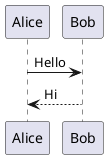
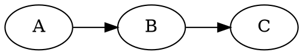

# pandia

Docker-based Markdown-to-PDF/HTML converter with built-in support for diagrams and LaTeX math.
All diagrams render as **vector graphics** (PDF/SVG) for crisp output at any zoom level.

## Supported Features

| Feature    | Code Block Syntax   | Rendering Method         |
|------------|---------------------|--------------------------|
| PlantUML   | `` ```plantuml ``   | SVG → PDF via rsvg       |
| Graphviz   | `` ```graphviz ``   | Direct PDF / SVG via dot |
| Mermaid    | `` ```mermaid ``    | Direct PDF / SVG via mmdc|
| Ditaa      | `` ```ditaa ``      | PNG via PlantUML (raster)|
| LaTeX Math | `$...$` / `$$...$$` | Pandoc native            |

## Quick Start

```bash
# Generate PDF (default)
docker run --rm -v "$PWD:/data" yaccob/pandia myfile.md

# Generate HTML
docker run --rm -v "$PWD:/data" yaccob/pandia --html myfile.md

# Generate both
docker run --rm -v "$PWD:/data" yaccob/pandia --all myfile.md
```

## Options

```
Usage: docker run --rm -v "$PWD:/data" yaccob/pandia [OPTIONS] <input.md>

Options:
  --pdf              Generate PDF output (default if no format specified)
  --html             Generate HTML output
  --all              Generate both PDF and HTML
  -o, --output NAME  Base name for output files (default: derived from input)
  -h, --help         Show this help
```

## Example

Create a file `demo.md`:

````markdown
---
title: "Demo"
---

## Sequence Diagram



## Flowchart


## State Machine



## Formula

$$E = mc^2$$
````

Then run:

```bash
docker run --rm -v "$PWD:/data" yaccob/pandia --all demo.md
```

## Local Development (without Docker)

Requirements: `pandoc`, `pdflatex`, `plantuml`, `dot` (Graphviz), `mmdc` (Mermaid CLI), `rsvg-convert`.

```bash
make all      # build example.pdf + example.html
make pdf      # PDF only
make html     # HTML only
make clean    # remove generated files
```

## How It Works

pandia is a [Pandoc](https://pandoc.org/) wrapper with a custom Lua filter that intercepts
`plantuml`, `graphviz`, `mermaid`, and `ditaa` code blocks, renders them to images via their
respective CLI tools, and passes the results back to Pandoc for final PDF or HTML assembly.
LaTeX math is handled natively by Pandoc.

## License

MIT
