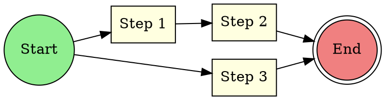
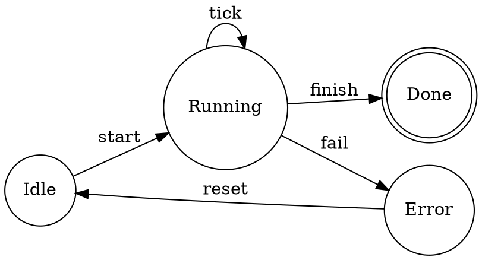
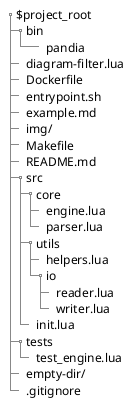
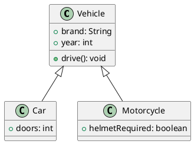
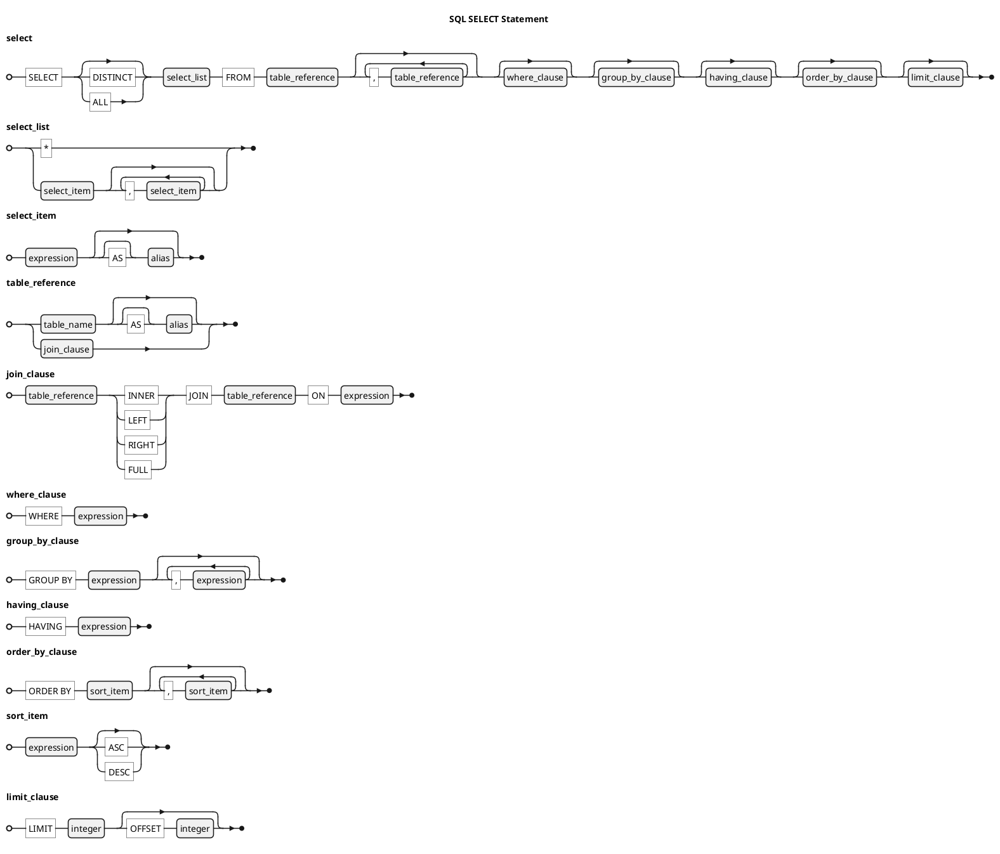
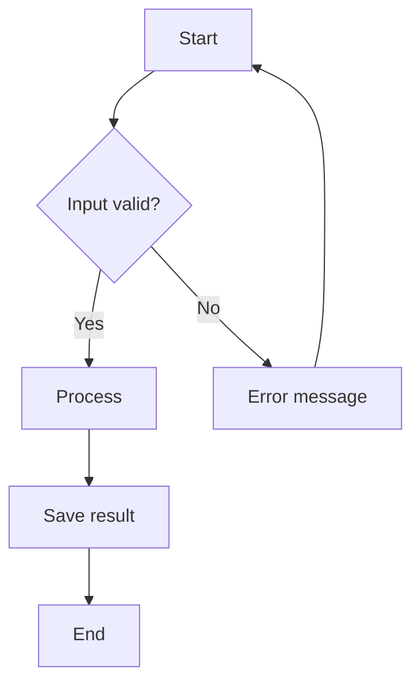
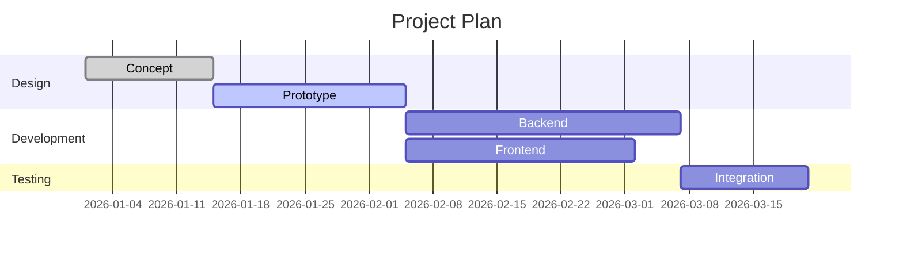

# Overview

This document demonstrates embedding diagrams and LaTeX formulas in Markdown.

**Diagram types:** PlantUML (including C4, EBNF, Salt), Graphviz, Mermaid, Markmap,
TikZ, Directory Trees, Nomnoml, DBML, D2, and WaveDrom.

**LaTeX math** (`$...$` inline, `$$...$$` block) is rendered natively by Pandoc.

All diagram types produce vector graphics (SVG).

---

## LaTeX Formulas (Pandoc native)

### Inline

Euler's identity $e^{i\pi} + 1 = 0$ connects five fundamental constants.

### Block Formulas

The quadratic formula:

$$x = \frac{-b \pm \sqrt{b^2 - 4ac}}{2a}$$

Deriving it by completing the square:

$$
\begin{alignedat}{2}
  ax^2 + bx + c &= 0           &\quad&|\; \div a \\
  x^2 + \frac{b}{a}x &= -\frac{c}{a} &&|\; + \left(\frac{b}{2a}\right)^2 \\
  \left(x + \frac{b}{2a}\right)^2 &= \frac{b^2 - 4ac}{4a^2} &&|\; \sqrt{\phantom{x}} \\
  x + \frac{b}{2a} &= \pm\frac{\sqrt{b^2 - 4ac}}{2a} &&|\; - \frac{b}{2a} \\
  x &= \frac{-b \pm \sqrt{b^2 - 4ac}}{2a}
\end{alignedat}
$$

The Gaussian integral:

$$\int_{-\infty}^{\infty} e^{-x^2}\, dx = \sqrt{\pi}$$

The Collatz conjecture considers the sequence:

$$a_{n+1} = \begin{cases} \frac{a_n}{2} & \text{if } a_n \text{ is even} \\ 3a_n + 1 & \text{if } a_n \text{ is odd} \end{cases}$$

---

## Local Diagram Types

### Directory Tree

A `` ```dir `` block renders a directory tree as an SVG graphic.
The hierarchy is defined purely by indentation — no special characters needed.
Directories are detected automatically (when they have children) or marked
explicitly with a trailing `/`. They are rendered in **bold**.

```dir
pandia
  bin
    pandia
  diagram-filter.lua
  Dockerfile
  entrypoint.sh
  example.md
  img/
  Makefile
  README.md
  src
    core
      engine.lua
      parser.lua
    utils
      helpers.lua
      io
        reader.lua
        writer.lua
    init.lua
  tests
    test_engine.lua
  empty-dir/
  .gitignore
```

### Graphviz – Directed Graph



### Graphviz – State Machine



### PlantUML Salt


### PlantUML - OpenIconic
```plantuml
listopeniconic
```

### PlantUML – Sequence Diagram

```plantuml
actor User
participant "Frontend" as FE
participant "Backend" as BE
database "Database" as DB

User -> FE : Send request
FE -> BE : REST call
BE -> DB : Query
DB --> BE : Result
BE --> FE : JSON
FE --> User : Display
```

### PlantUML – Class Diagram



### PlantUML – EBNF Syntax Diagram (SQL SELECT)



### PlantUML – C4 Context Diagram

```plantuml
!include <C4/C4_Context>

title System Context — pandia

Person(user, "Author", "Writes Markdown with diagrams")
System(pandia, "pandia Server", "Renders Markdown to HTML/PDF with embedded diagrams")
System_Ext(vscode, "VS Code Extension", "Live preview panel")

Rel(user, pandia, "POST /render", "HTTP")
Rel(vscode, pandia, "POST /render", "HTTP")
```

### Mermaid – Flowchart



### Mermaid – Gantt Chart



### Markmap – Interactive Mind Map

In HTML output, this renders as an interactive, expandable mind map.
In PDF output, a static snapshot is used.

```markmap
# Software Architecture
## Frontend
### Framework
#### React
#### Vue.js
#### Angular
### Build Tools
#### Vite
#### Webpack
### Testing
#### Jest
#### Cypress
## Backend
### Languages
#### TypeScript / Node.js
#### Python
#### Go
### Databases
#### PostgreSQL
#### Redis
#### MongoDB
### API
#### REST
#### GraphQL
## Infrastructure
### Containers
#### Docker
#### Kubernetes
### CI/CD
#### GitHub Actions
#### GitLab CI
### Monitoring
#### Prometheus
#### Grafana
```

### TikZ – Vector Drawing

```tikz
\usepackage{tikz-3dplot}
\tdplotsetmaincoords{80}{125}
  \begin{tikzpicture}[tdplot_main_coords,scale=0.75]
    % Indicate the components of the vector in rectangular coordinates
    \pgfmathsetmacro{\ux}{4}
    \pgfmathsetmacro{\uy}{4}
    \pgfmathsetmacro{\uz}{3}
    % Length of each axis
    \pgfmathsetmacro{\ejex}{\ux+0.5}
    \pgfmathsetmacro{\ejey}{\uy+0.5}
    \pgfmathsetmacro{\ejez}{\uz+0.5}
    \pgfmathsetmacro{\umag}{sqrt(\ux*\ux+\uy*\uy+\uz*\uz)} % Magnitude of vector $\vec{u}$
    % Compute the angle $\theta$
    \pgfmathsetmacro{\angthetax}{pi*atan(\uy/\ux)/180}
    \pgfmathsetmacro{\angthetay}{pi*atan(\ux/\uz)/180}
    \pgfmathsetmacro{\angthetaz}{pi*atan(\uz/\uy)/180}
    % Compute the angle $\phi$
    \pgfmathsetmacro{\angphix}{pi*acos(\ux/\umag)/180}
    \pgfmathsetmacro{\angphiy}{pi*acos(\uy/\umag)/180}
    \pgfmathsetmacro{\angphiz}{pi*acos(\uz/\umag)/180}
    % Compute rho sin(phi) to simplify computations
    \pgfmathsetmacro{\costz}{cos(\angthetax r)}
    \pgfmathsetmacro{\sintz}{sin(\angthetax r)}
    \pgfmathsetmacro{\costy}{cos(\angthetay r)}
    \pgfmathsetmacro{\sinty}{sin(\angthetay r)}
    \pgfmathsetmacro{\costx}{cos(\angthetaz r)}
    \pgfmathsetmacro{\sintx}{sin(\angthetaz r)}
    % Coordinate axis
    \draw[thick,->] (0,0,0) -- (\ejex,0,0) node[below left] {$x$};
    \draw[thick,->] (0,0,0) -- (0,\ejey,0) node[right] {$y$};
    \draw[thick,->] (0,0,0) -- (0,0,\ejez) node[above] {$z$};
    % Projections of the components in the axis
    \draw[gray,very thin,opacity=0.5] (0,0,0) -- (\ux,0,0) -- (\ux,\uy,0) -- (0,\uy,0) -- (0,0,0);	% face on the plane z = 0
    \draw[gray,very thin,opacity=0.5] (0,0,\uz) -- (\ux,0,\uz) -- (\ux,\uy,\uz) -- (0,\uy,\uz) -- (0,0,\uz);	% face on the plane z = \uz
    \draw[gray,very thin,opacity=0.5] (0,0,0) -- (0,0,\uz) -- (\ux,0,\uz) -- (\ux,0,0) -- (0,0,0);	% face on the plane y = 0
    \draw[gray,very thin,opacity=0.5] (0,\uy,0) -- (0,\uy,\uz) -- (\ux,\uy,\uz) -- (\ux,\uy,0) -- (0,\uy,0);	% face on the plane y = \uy
    \draw[gray,very thin,opacity=0.5] (0,0,0) -- (0,\uy,0) -- (0,\uy,\uz) -- (0,0,\uz) -- (0,0,0); % face on the plane x = 0
    \draw[gray,very thin,opacity=0.5] (\ux,0,0) -- (\ux,\uy,0) -- (\ux,\uy,\uz) -- (\ux,0,\uz) -- (\ux,0,0); % face on the plane x = \ux
    % Arc indicating the angle $\alpha$
    % (angle formed by the vector $\vec{v}$ and the $x$ axis)
    \draw[red,thick] plot[domain=0:\angphix,smooth,variable=\t] ({cos(\t r)},{sin(\t r)*\costx},{sin(\t r)*\sintx});
    % Arc indicating the angle $\beta$
    % (angle formed by the vector $\vec{v}$ and the $y$ axis)
    \draw[red,thick] plot[domain=0:\angphiy,smooth,variable=\t] ({sin(\t r)*\sinty},{cos(\t r)},{sin(\t r)*\costy});
    % Arc indicating the angle $\gamma$
    % (angle formed by the vector $\vec{v}$ and the $z$ axis)
    \draw[red,thick] plot[domain=0:\angphiz,smooth,variable=\t] ({sin(\t r)*\costz},{sin(\t r)*\sintz},{cos(\t r)});
    % Vector $\vec{u}$
    \draw[blue,thick,->] (0,0,0) -- (\ux,\uy,\uz) node [below right] {$\vec{u}$};
    % Nodes indicating the direction angles
    \pgfmathsetmacro{\xa}{1.85*cos(0.5*\angphix r)}
    \pgfmathsetmacro{\ya}{1.85*sin(0.5*\angphix r)*\costx}
    \pgfmathsetmacro{\za}{1.85*sin(0.5*\angphiz r)*\sintx}
    \node[red] at (\xa,\ya,\za) {\footnotesize$\alpha$};
    %
    \pgfmathsetmacro{\xb}{1.5*sin(0.5*\angphiy r)*\sinty}
    \pgfmathsetmacro{\yb}{1.5*cos(0.5*\angphiy r)}
    \pgfmathsetmacro{\zb}{1.5*sin(0.5*\angphiy r)*\costy}
    \node[red] at (\xb,\yb,\zb) {\footnotesize$\beta$};
    %
    \pgfmathsetmacro{\xc}{1.5*sin(0.5*\angphiz r)*\costz}
    \pgfmathsetmacro{\yc}{1.5*sin(0.5*\angphiz r)*\sintz}
    \pgfmathsetmacro{\zc}{1.5*cos(0.5*\angphiz r)}
    \node[red] at (\xc,\yc,\zc) {\footnotesize$\gamma$};
    %
  \end{tikzpicture}
```

### DBML – Database Schema

```dbml
Table users {
  id integer [primary key, increment]
  username varchar [unique, not null]
  email varchar [unique, not null]
  created_at timestamp [default: `now()`]
}

Table posts {
  id integer [primary key, increment]
  title varchar [not null]
  body text
  status varchar [default: 'draft']
  user_id integer [ref: > users.id]
  created_at timestamp [default: `now()`]
}

Table comments {
  id integer [primary key, increment]
  body text [not null]
  post_id integer [ref: > posts.id]
  user_id integer [ref: > users.id]
}
```

### Nomnoml – UML Diagrams

```nomnoml
[<frame>Authentication Flow |
  [User] -> [Login Form]
  [Login Form] -> [Auth Service]
  [Auth Service] -> [<database> User DB]
  [Auth Service] -> [Token Service]
  [Token Service] --> [User]
]
```

### D2 – Declarative Diagrams

```d2
Server: {
  API Gateway -> Auth Service
  API Gateway -> User Service
  API Gateway -> Order Service
  Auth Service -> Redis
  User Service -> PostgreSQL
  Order Service -> PostgreSQL
  Order Service -> Message Queue
}
```

### WaveDrom – Digital Timing Diagrams

```wavedrom
{ "signal": [
  { "name": "clk",   "wave": "p........." },
  { "name": "req",   "wave": "0.1..0...." },
  { "name": "ack",   "wave": "0..1..0..." },
  { "name": "data",  "wave": "x..345x..." },
  { "name": "valid", "wave": "0..1..0..." }
]}
```

---

## Summary

| Feature   | Syntax              | Notes                       |
|-----------|---------------------|-----------------------------|
| LaTeX     | `$...$` / `$$...$$` | Pandoc native               |
| Dir Tree  | `` ```dir ``        |                             |
| Graphviz  | `` ```graphviz ``   |                             |
| PlantUML  | `` ```plantuml ``   | incl. C4, EBNF, Salt        |
| Mermaid   | `` ```mermaid ``    |                             |
| Markmap   | `` ```markmap ``    | Interactive in HTML         |
| TikZ      | `` ```tikz ``       |                             |
| DBML      | `` ```dbml ``       |                             |
| Nomnoml   | `` ```nomnoml ``    |                             |
| D2        | `` ```d2 ``         |                             |
| WaveDrom  | `` ```wavedrom ``   |                             |
