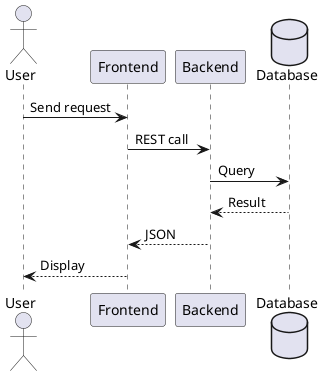
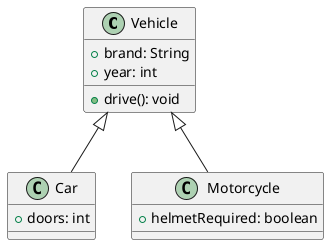
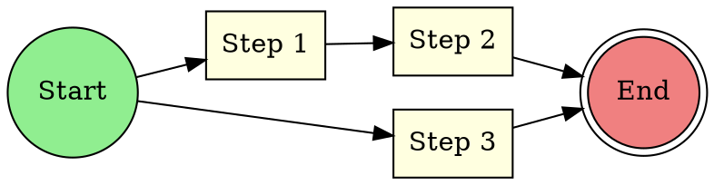
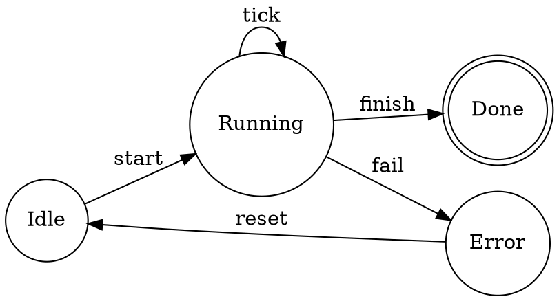
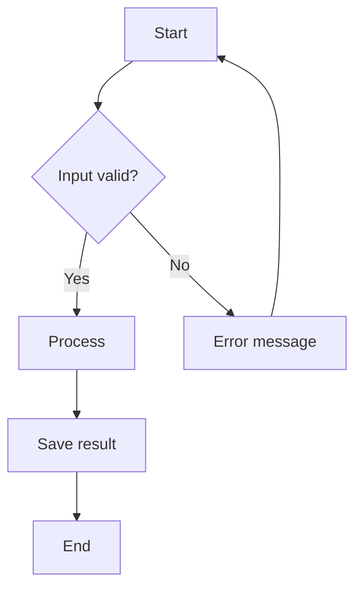
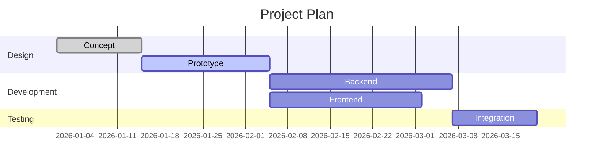

# Overview

This document demonstrates embedding **PlantUML**, **Graphviz**, **Mermaid**,
**Ditaa**, and **LaTeX formulas** in a Markdown document.

---

## PlantUML – Sequence Diagram



## PlantUML – Class Diagram



## Graphviz – Directed Graph



## Graphviz – State Machine



## Mermaid – Flowchart



## Mermaid – Gantt Chart



## Ditaa – ASCII Art Diagram

```ditaa
    +--------+   +-------+    +-------+
    |        +---+ ditaa +----+       |
    | Text   |   +-------+    |Diagram|
    |Document|   |{io}   |    |       |
    |     {d}|   |       |    |       |
    +---+----+   +-------+    +-------+
        :                         ^
        |       Generation        |
        +-------------------------+
```

## TikZ – Vector Drawing

```tikz
\begin{tikzpicture}[node distance=2cm, auto, thick]
  \node[circle, draw, fill=green!20] (start) {Start};
  \node[rectangle, draw, fill=blue!10, right of=start] (process) {Process};
  \node[diamond, draw, fill=yellow!20, aspect=2, right of=process] (decision) {OK?};
  \node[circle, draw, fill=red!20, right of=decision] (end) {End};
  \node[rectangle, draw, fill=orange!10, below of=decision] (fix) {Fix};

  \draw[->] (start) -- (process);
  \draw[->] (process) -- (decision);
  \draw[->] (decision) -- node {yes} (end);
  \draw[->] (decision) -- node {no} (fix);
  \draw[->] (fix) -| (process);
\end{tikzpicture}
```

## LaTeX Formulas

### Inline

Euler's identity $e^{i\pi} + 1 = 0$ connects five fundamental constants.

### Block Formulas

The quadratic formula:

$$x = \frac{-b \pm \sqrt{b^2 - 4ac}}{2a}$$

Deriving it by completing the square:

$$
\begin{flalign*}
& \begin{alignedat}[t]{2}
  ax^2 + bx + c &= 0           &\quad&| \div a \\
  x^2 + \frac{b}{a}x &= -\frac{c}{a} &&| + \left(\frac{b}{2a}\right)^2 \\
  \left(x + \frac{b}{2a}\right)^2 &= \frac{b^2 - 4ac}{4a^2} &&| \sqrt{\phantom{x}} \\
  x + \frac{b}{2a} &= \pm\frac{\sqrt{b^2 - 4ac}}{2a} &&| - \frac{b}{2a} \\
  x &= \frac{-b \pm \sqrt{b^2 - 4ac}}{2a}
\end{alignedat} &
\end{flalign*}
$$

The Gaussian integral:

$$\int_{-\infty}^{\infty} e^{-x^2}\, dx = \sqrt{\pi}$$

The Collatz conjecture considers the sequence:

$$a_{n+1} = \begin{cases} \frac{a_n}{2} & \text{if } a_n \text{ is even} \\ 3a_n + 1 & \text{if } a_n \text{ is odd} \end{cases}$$

## Summary

| Feature   | Syntax              | Rendering      |
|-----------|---------------------|----------------|
| PlantUML  | `` ```plantuml ``   | via Lua filter |
| Graphviz  | `` ```graphviz ``   | via Lua filter |
| Mermaid   | `` ```mermaid ``    | via Lua filter |
| Ditaa     | `` ```ditaa ``      | via Lua filter |
| TikZ      | `` ```tikz ``       | via Lua filter |
| LaTeX     | `$...$` / `$$...$$` | Pandoc native  |
