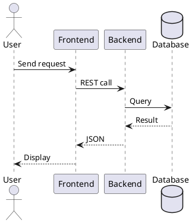
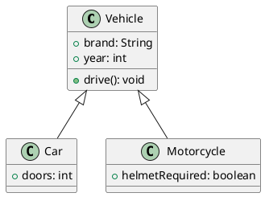
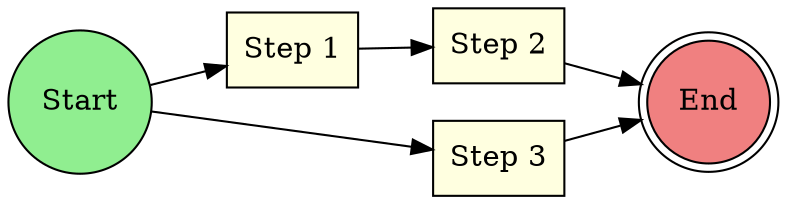
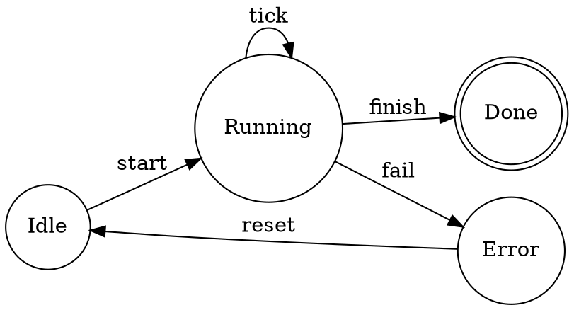
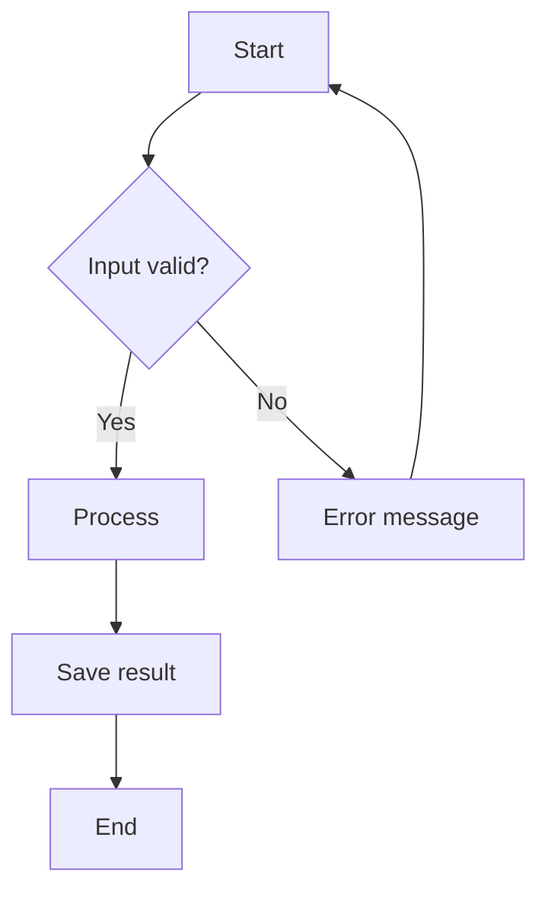
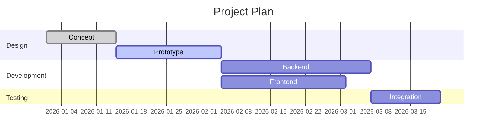

# Overview

This document demonstrates embedding **PlantUML**, **Graphviz**, **Mermaid**,
**Ditaa**, **TikZ**, **Directory Trees**, and **LaTeX formulas** in a Markdown document.
With `--kroki`, additional diagram types like **BPMN**, **D2**, **ERD**,
**Svgbob**, **WaveDrom**, **Nomnoml**, and **Pikchr** are available.

---

## Directory Tree

A `` ```dir `` block renders a directory tree as an SVG graphic.
The hierarchy is defined purely by indentation — no special characters needed.
Directories are detected automatically (when they have children) or marked
explicitly with a trailing `/`. They are rendered in **bold**.

```dir
pandia
  bin
    pandia
  diagram-filter.lua
  Dockerfile
  entrypoint.sh
  example.md
  img/
  Makefile
  README.md
  src
    core
      engine.lua
      parser.lua
    utils
      helpers.lua
      io
        reader.lua
        writer.lua
    init.lua
  tests
    test_engine.lua
  empty-dir/
  .gitignore
```

## PlantUML – Sequence Diagram



## PlantUML – Class Diagram



## Graphviz – Directed Graph



## Graphviz – State Machine



## Mermaid – Flowchart



## Mermaid – Gantt Chart



## Ditaa – ASCII Art Diagram

```ditaa
    +--------+   +-------+    +-------+
    |        +---+ ditaa +----+       |
    | Text   |   +-------+    |Diagram|
    |Document|   |{io}   |    |       |
    |     {d}|   |       |    |       |
    +---+----+   +-------+    +-------+
        :                         ^
        |       Generation        |
        +-------------------------+
```

## TikZ – Vector Drawing

```tikz
\usepackage{tikz-3dplot}
\tdplotsetmaincoords{80}{125}
  \begin{tikzpicture}[tdplot_main_coords,scale=0.75]
    % Indicate the components of the vector in rectangular coordinates
    \pgfmathsetmacro{\ux}{4}
    \pgfmathsetmacro{\uy}{4}
    \pgfmathsetmacro{\uz}{3}
    % Length of each axis
    \pgfmathsetmacro{\ejex}{\ux+0.5}
    \pgfmathsetmacro{\ejey}{\uy+0.5}
    \pgfmathsetmacro{\ejez}{\uz+0.5}
    \pgfmathsetmacro{\umag}{sqrt(\ux*\ux+\uy*\uy+\uz*\uz)} % Magnitude of vector $\vec{u}$
    % Compute the angle $\theta$
    \pgfmathsetmacro{\angthetax}{pi*atan(\uy/\ux)/180}
    \pgfmathsetmacro{\angthetay}{pi*atan(\ux/\uz)/180}
    \pgfmathsetmacro{\angthetaz}{pi*atan(\uz/\uy)/180}
    % Compute the angle $\phi$
    \pgfmathsetmacro{\angphix}{pi*acos(\ux/\umag)/180}
    \pgfmathsetmacro{\angphiy}{pi*acos(\uy/\umag)/180}
    \pgfmathsetmacro{\angphiz}{pi*acos(\uz/\umag)/180}
    % Compute rho sin(phi) to simplify computations
    \pgfmathsetmacro{\costz}{cos(\angthetax r)}
    \pgfmathsetmacro{\sintz}{sin(\angthetax r)}
    \pgfmathsetmacro{\costy}{cos(\angthetay r)}
    \pgfmathsetmacro{\sinty}{sin(\angthetay r)}
    \pgfmathsetmacro{\costx}{cos(\angthetaz r)}
    \pgfmathsetmacro{\sintx}{sin(\angthetaz r)}
    % Coordinate axis
    \draw[thick,->] (0,0,0) -- (\ejex,0,0) node[below left] {$x$};
    \draw[thick,->] (0,0,0) -- (0,\ejey,0) node[right] {$y$};
    \draw[thick,->] (0,0,0) -- (0,0,\ejez) node[above] {$z$};
    % Projections of the components in the axis
    \draw[gray,very thin,opacity=0.5] (0,0,0) -- (\ux,0,0) -- (\ux,\uy,0) -- (0,\uy,0) -- (0,0,0);	% face on the plane z = 0
    \draw[gray,very thin,opacity=0.5] (0,0,\uz) -- (\ux,0,\uz) -- (\ux,\uy,\uz) -- (0,\uy,\uz) -- (0,0,\uz);	% face on the plane z = \uz
    \draw[gray,very thin,opacity=0.5] (0,0,0) -- (0,0,\uz) -- (\ux,0,\uz) -- (\ux,0,0) -- (0,0,0);	% face on the plane y = 0
    \draw[gray,very thin,opacity=0.5] (0,\uy,0) -- (0,\uy,\uz) -- (\ux,\uy,\uz) -- (\ux,\uy,0) -- (0,\uy,0);	% face on the plane y = \uy
    \draw[gray,very thin,opacity=0.5] (0,0,0) -- (0,\uy,0) -- (0,\uy,\uz) -- (0,0,\uz) -- (0,0,0); % face on the plane x = 0
    \draw[gray,very thin,opacity=0.5] (\ux,0,0) -- (\ux,\uy,0) -- (\ux,\uy,\uz) -- (\ux,0,\uz) -- (\ux,0,0); % face on the plane x = \ux
    % Arc indicating the angle $\alpha$
    % (angle formed by the vector $\vec{v}$ and the $x$ axis)
    \draw[red,thick] plot[domain=0:\angphix,smooth,variable=\t] ({cos(\t r)},{sin(\t r)*\costx},{sin(\t r)*\sintx});
    % Arc indicating the angle $\beta$
    % (angle formed by the vector $\vec{v}$ and the $y$ axis)
    \draw[red,thick] plot[domain=0:\angphiy,smooth,variable=\t] ({sin(\t r)*\sinty},{cos(\t r)},{sin(\t r)*\costy});
    % Arc indicating the angle $\gamma$
    % (angle formed by the vector $\vec{v}$ and the $z$ axis)
    \draw[red,thick] plot[domain=0:\angphiz,smooth,variable=\t] ({sin(\t r)*\costz},{sin(\t r)*\sintz},{cos(\t r)});
    % Vector $\vec{u}$
    \draw[blue,thick,->] (0,0,0) -- (\ux,\uy,\uz) node [below right] {$\vec{u}$};
    % Nodes indicating the direction angles
    \pgfmathsetmacro{\xa}{1.85*cos(0.5*\angphix r)}
    \pgfmathsetmacro{\ya}{1.85*sin(0.5*\angphix r)*\costx}
    \pgfmathsetmacro{\za}{1.85*sin(0.5*\angphiz r)*\sintx}
    \node[red] at (\xa,\ya,\za) {\footnotesize$\alpha$};
    %
    \pgfmathsetmacro{\xb}{1.5*sin(0.5*\angphiy r)*\sinty}
    \pgfmathsetmacro{\yb}{1.5*cos(0.5*\angphiy r)}
    \pgfmathsetmacro{\zb}{1.5*sin(0.5*\angphiy r)*\costy}
    \node[red] at (\xb,\yb,\zb) {\footnotesize$\beta$};
    %
    \pgfmathsetmacro{\xc}{1.5*sin(0.5*\angphiz r)*\costz}
    \pgfmathsetmacro{\yc}{1.5*sin(0.5*\angphiz r)*\sintz}
    \pgfmathsetmacro{\zc}{1.5*cos(0.5*\angphiz r)}
    \node[red] at (\xc,\yc,\zc) {\footnotesize$\gamma$};
    %
  \end{tikzpicture}
```

## Kroki-powered Diagrams

The following diagrams are rendered via [Kroki](https://kroki.io) and require
`--kroki` or `--kroki-server URL`. They are ignored without Kroki enabled.

### BPMN – Business Process

```bpmn
<?xml version="1.0" encoding="UTF-8"?>
<definitions xmlns="http://www.omg.org/spec/BPMN/20100524/MODEL"
             xmlns:bpmndi="http://www.omg.org/spec/BPMN/20100524/DI"
             xmlns:dc="http://www.omg.org/spec/DD/20100524/DC"
             xmlns:di="http://www.omg.org/spec/DD/20100524/DI"
             id="Definitions_1" targetNamespace="http://example.com">
  <process id="Process_1" isExecutable="false">
    <startEvent id="Start" name="Order received"/>
    <task id="Task1" name="Validate order"/>
    <exclusiveGateway id="GW1" name="Valid?"/>
    <task id="Task2" name="Process payment"/>
    <task id="Task3" name="Reject order"/>
    <endEvent id="End1" name="Order completed"/>
    <endEvent id="End2" name="Order rejected"/>
    <sequenceFlow id="F1" sourceRef="Start" targetRef="Task1"/>
    <sequenceFlow id="F2" sourceRef="Task1" targetRef="GW1"/>
    <sequenceFlow id="F3" name="yes" sourceRef="GW1" targetRef="Task2"/>
    <sequenceFlow id="F4" name="no" sourceRef="GW1" targetRef="Task3"/>
    <sequenceFlow id="F5" sourceRef="Task2" targetRef="End1"/>
    <sequenceFlow id="F6" sourceRef="Task3" targetRef="End2"/>
  </process>
  <bpmndi:BPMNDiagram id="BPMNDiagram_1">
    <bpmndi:BPMNPlane id="BPMNPlane_1" bpmnElement="Process_1">
      <bpmndi:BPMNShape id="Start_di" bpmnElement="Start">
        <dc:Bounds x="160" y="100" width="36" height="36"/>
      </bpmndi:BPMNShape>
      <bpmndi:BPMNShape id="Task1_di" bpmnElement="Task1">
        <dc:Bounds x="250" y="78" width="100" height="80"/>
      </bpmndi:BPMNShape>
      <bpmndi:BPMNShape id="GW1_di" bpmnElement="GW1" isMarkerVisible="true">
        <dc:Bounds x="405" y="93" width="50" height="50"/>
      </bpmndi:BPMNShape>
      <bpmndi:BPMNShape id="Task2_di" bpmnElement="Task2">
        <dc:Bounds x="510" y="20" width="100" height="80"/>
      </bpmndi:BPMNShape>
      <bpmndi:BPMNShape id="Task3_di" bpmnElement="Task3">
        <dc:Bounds x="510" y="150" width="100" height="80"/>
      </bpmndi:BPMNShape>
      <bpmndi:BPMNShape id="End1_di" bpmnElement="End1">
        <dc:Bounds x="670" y="42" width="36" height="36"/>
      </bpmndi:BPMNShape>
      <bpmndi:BPMNShape id="End2_di" bpmnElement="End2">
        <dc:Bounds x="670" y="172" width="36" height="36"/>
      </bpmndi:BPMNShape>
      <bpmndi:BPMNEdge id="F1_di" bpmnElement="F1">
        <di:waypoint x="196" y="118"/>
        <di:waypoint x="250" y="118"/>
      </bpmndi:BPMNEdge>
      <bpmndi:BPMNEdge id="F2_di" bpmnElement="F2">
        <di:waypoint x="350" y="118"/>
        <di:waypoint x="405" y="118"/>
      </bpmndi:BPMNEdge>
      <bpmndi:BPMNEdge id="F3_di" bpmnElement="F3">
        <di:waypoint x="430" y="93"/>
        <di:waypoint x="430" y="60"/>
        <di:waypoint x="510" y="60"/>
      </bpmndi:BPMNEdge>
      <bpmndi:BPMNEdge id="F4_di" bpmnElement="F4">
        <di:waypoint x="430" y="143"/>
        <di:waypoint x="430" y="190"/>
        <di:waypoint x="510" y="190"/>
      </bpmndi:BPMNEdge>
      <bpmndi:BPMNEdge id="F5_di" bpmnElement="F5">
        <di:waypoint x="610" y="60"/>
        <di:waypoint x="670" y="60"/>
      </bpmndi:BPMNEdge>
      <bpmndi:BPMNEdge id="F6_di" bpmnElement="F6">
        <di:waypoint x="610" y="190"/>
        <di:waypoint x="670" y="190"/>
      </bpmndi:BPMNEdge>
    </bpmndi:BPMNPlane>
  </bpmndi:BPMNDiagram>
</definitions>
```

### D2 – Declarative Diagrams

```d2
server: Web Server {
  handler: Request Handler
  auth: Auth Middleware
  db: Database Pool
}

client: Browser
cdn: CDN

client -> cdn: Static assets
client -> server.handler: API requests
server.handler -> server.auth: Authenticate
server.auth -> server.db: Query
```

### DBML – Database Schema

```dbml
Table users {
  id integer [primary key]
  username varchar [not null, unique]
  email varchar [not null]
  created_at timestamp [default: `now()`]
}

Table posts {
  id integer [primary key]
  title varchar [not null]
  body text
  user_id integer [ref: > users.id]
  created_at timestamp
}

Table comments {
  id integer [primary key]
  body text [not null]
  post_id integer [ref: > posts.id]
  user_id integer [ref: > users.id]
}
```

### Entity Relationship Diagram

```erd
[Customer]
*id
name
email

[Order]
*id
date
total

[Product]
*id
name
price

Customer 1--* Order
Order *--* Product
```

### Svgbob – ASCII Art to SVG

```svgbob
        .--.            .---.
       /    \          |     |
      |  DB  |<------->| API |
       \    /          |     |
        '--'            '---'
          |               |
          v               v
        .---.           .---.
       | Log |         | Web |
        '---'           '---'
```

### WaveDrom – Timing Diagram

```wavedrom
{ "signal": [
  { "name": "clk",  "wave": "p........." },
  { "name": "req",  "wave": "0.1..0.1.." },
  { "name": "ack",  "wave": "0..1.0..1." },
  { "name": "data", "wave": "x..345x...", "data": ["A", "B", "C"] }
]}
```

### Nomnoml – UML Diagrams

```nomnoml
[<frame>MVC Pattern |
  [Controller] -> [Model]
  [Controller] -> [View]
  [Model] --> [View]
  [View] --:> [Controller]
]
```

### Pikchr – Technical Illustrations

```pikchr
arrow right 200% "Input" above
box rad 10px "Process" fit
arrow right 200% "Output" above
```

---

## LaTeX Formulas

### Inline

Euler's identity $e^{i\pi} + 1 = 0$ connects five fundamental constants.

### Block Formulas

The quadratic formula:

$$x = \frac{-b \pm \sqrt{b^2 - 4ac}}{2a}$$

Deriving it by completing the square:

$$
\begin{alignedat}{2}
  ax^2 + bx + c &= 0           &\quad&| \div a \\
  x^2 + \frac{b}{a}x &= -\frac{c}{a} &&| + \left(\frac{b}{2a}\right)^2 \\
  \left(x + \frac{b}{2a}\right)^2 &= \frac{b^2 - 4ac}{4a^2} &&| \sqrt{\phantom{x}} \\
  x + \frac{b}{2a} &= \pm\frac{\sqrt{b^2 - 4ac}}{2a} &&| - \frac{b}{2a} \\
  x &= \frac{-b \pm \sqrt{b^2 - 4ac}}{2a}
\end{alignedat}
$$

The Gaussian integral:

$$\int_{-\infty}^{\infty} e^{-x^2}\, dx = \sqrt{\pi}$$

The Collatz conjecture considers the sequence:

$$a_{n+1} = \begin{cases} \frac{a_n}{2} & \text{if } a_n \text{ is even} \\ 3a_n + 1 & \text{if } a_n \text{ is odd} \end{cases}$$

## Summary

| Feature   | Syntax              | Rendering       |
|-----------|---------------------|-----------------|
| PlantUML  | `` ```plantuml ``   | Local           |
| Graphviz  | `` ```graphviz ``   | Local           |
| Mermaid   | `` ```mermaid ``    | Local           |
| Ditaa     | `` ```ditaa ``      | Local           |
| TikZ      | `` ```tikz ``       | Local           |
| Dir Tree  | `` ```dir ``        | Local (SVG)     |
| BPMN      | `` ```bpmn ``       | Kroki           |
| D2        | `` ```d2 ``         | Kroki           |
| DBML      | `` ```dbml ``       | Kroki           |
| ERD       | `` ```erd ``        | Kroki           |
| Svgbob    | `` ```svgbob ``     | Kroki           |
| WaveDrom  | `` ```wavedrom ``   | Kroki           |
| Nomnoml   | `` ```nomnoml ``    | Kroki           |
| Pikchr    | `` ```pikchr ``     | Kroki           |
| LaTeX     | `$...$` / `$$...$$` | Pandoc native  |
